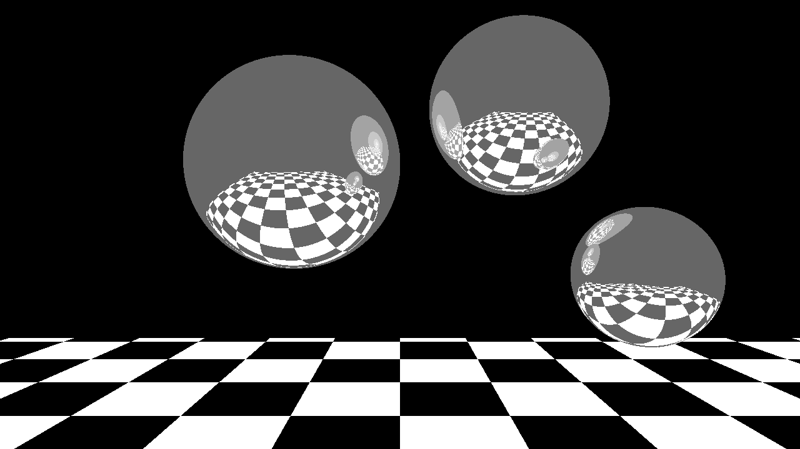

# Simple-Raytracer

This raytracer was created as a part of a C++ course for the study Applied Computer Science at the Rotterdam University of Applied Sciences.
This raytracer will render a image of 3 reflective spheres floating above a checkerboard floor.

## Example Image

